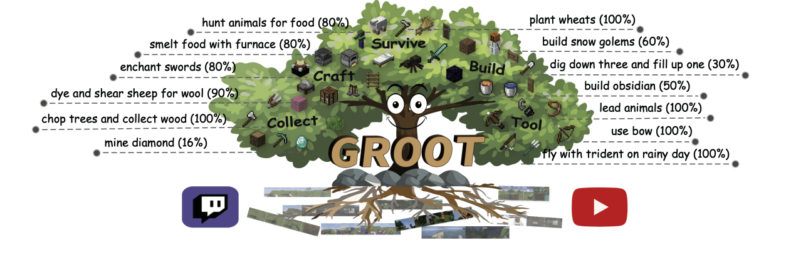

# GROOT: Learning to Follow Instructions by Watching Gameplay Videos

<div align="center">



[[Website]](http://craftjarvis.github.io/GROOT)
[[Arxiv Paper]](https://arxiv.org/abs/2310.08235)
[[Team]](https://github.com/CraftJarvis)

[](https://pypi.org/project/MineDojo/)
[](https://pytorch.org/)
[](https://github.com/MineDojo/MineCLIP/blob/main/license)

</div>

## Install Dependencies

```bash
sudo apt install -y xvfb
conda create -n groot python=3.9.16 -y 
conda activate groot 
conda install --channel=conda-forge openjdk=8 gym=0.19 -y 
pip install git+https://github.com/karpathy/minGPT.git 
git clone git@github.com:CraftJarvis/GROOT.git
pip install -e .
```

Then, download simulator from [here](https://drive.google.com/file/d/1NV6DwBbkgaOCGrmJMj_dtJBCdrEl1oI6/view?usp=sharing) and extract it. 

```bash
tar -zxvf mcp.tar.gz -C jarvis/stark_tech/
```

Then, run the simulator.
```bash
cd jarvis/stark_tech
xvfb-run -a python env_interface.py
```

If you see the following logs, then the simulator is successfully installed. 

```
[Close-ended] Slow reset with world seed:  19961103
Dict('buttons': MultiDiscrete([8641]), 'camera': MultiDiscrete([121]))
dict_keys(['pov', 'inventory', 'equipped_items', 'pickup', 'break_item', 'craft_item', 'mine_block', 'kill_entity', 'player_pos', 'is_gui_open'])
{'x': 541.5, 'y': 15.0, 'z': 358.5, 'pitch': 0.0, 'yaw': 0.0}
frame: 0, fps: 13.20, avg_fps: 13.20
frame: 50, fps: 26.53, avg_fps: 27.48
Simulator is being closed.
```

## Download Weights
Here we provide some checkpoints for evaluation. 

+ **GROOT_EFF_1x** [[1x weights A]](https://drive.google.com/file/d/1-002Q_wmp7p1LxvArKjza930L88dIkj0/view?usp=sharing) [[1x weights B]](https://drive.google.com/file/d/1-2ufYRpmeSeUqmTZMNamSdlFJaeO8_bz/view?usp=sharing)
+ **VPT_NATIVE** [[2x model]](https://openaipublic.blob.core.windows.net/minecraft-rl/models/2x.model) [[early-game-finetuned]](https://openaipublic.blob.core.windows.net/minecraft-rl/models/bc-early-game-2x.weights)

## Run Evaluation

Check the policy configs (```jarvis/arm/configs```) and assign the right checkpoint path. 

```bash
# evaluate vanilla VPT model
export JARVISBASE_PRETRAINED="/path/to/ckptdir"
xvfb-run -a python run_agent.py --test 'run_test_vpt_single'
# evaluate GROOT model
xvfb-run -a python run_agent.py --test 'run_test_groot_single'
# evaluate GROOT model with the logit-subtraction trick
xvfb-run -a python run_agent.py --test 'run_test_groot_subtract'
```

## Citation

```latex
@article{cai2023groot,
  title={Groot: Learning to follow instructions by watching gameplay videos},
  author={Cai, Shaofei and Zhang, Bowei and Wang, Zihao and Ma, Xiaojian and Liu, Anji and Liang, Yitao},
  journal={arXiv preprint arXiv:2310.08235},
  year={2023}
}
```